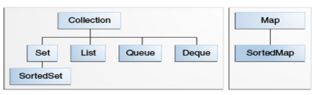

# Java Collections

### Общее описание и роль

Интерфейсы из `java.util` предоставляют основные абстракции для работы с группами объектов:

* Collection - корневой интерфейс коллекций. Представляет контракт для работы с группой объектов называемых элементами.
* List - упорядоченная коллекция, допускающая дублирование объектов и доступ по индексу.
* Set - неупорядоченная коллекция без дубликатов.
* Map - отображение ключ → значение, где ключи уникальны.
* Queue - группа элементов с приоритетным образом обработки элементов FIFO
* Deque - группа элементов с приоритетным образом обработки элементов FIFO и LIFO

И ещё два важных интерфейса расширающих Set и Map
* SoretdSet - Set который поддерживает определнный порядок элементов.
* SortedMap - Map который поддерживает определенный порядок ключей.

